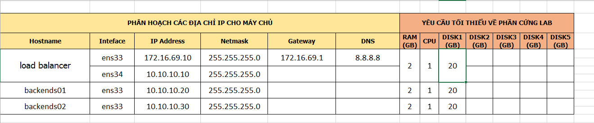

# Cài đặt openresty kết hợp với galera sử dụng mariadb trong mô hình nginx

# Mục lục

- [Vấn đề bài toán và mô hình](#issue)
- [Cài đặt mariadb và galera](#install)
- [Cấu hình galera cho các node](#config)
- [Cấu hình cho load balancer](#load-balancer)
- [Các nội dung khác](#content-others)

# Nội dung

- #### <a name="issue">Vấn đề bài toán và mô hình</a>

	+ Trong các mô hình website, sẽ có những trường hợp một máy chủ chứa database bị lỗi, không thể đáp ứng được cho hoạt động của ứng dụng sử dụng nó chẳng hạn như website. Để đảm bảo cho tính luôn sẵn sàng hoạt động ổn định nhất, ta cần phải có một database khác thay thế cho database cũ đang ngừng hoạt động để duy trì cho ứng dụng được tiếp tục hoạt động.

	+ Mô hình có thể được minh họa như sau:

		

	+ IP Planning như sau:
		
		

- #### <a name="install">Cài đặt mariadb và galera</a>

	##### Lưu ý:
			- Các câu lệnh được thực hiện trên OS: Centos 7
			- Chạy với quyền của superuser (root)

	+ Cài đặt Galera

		- Trên cả 2 node backends01, backends02, ta tiến hành chạy câu lệnh sau để thêm repository:

				# echo '[mariadb]
				 name = Mariadb
				 baseurl = http://yum.mariadb.org/10.1/centos7-amd64
				 gpgkey=https://yum.mariadb.org/rpm-gpg-key-mariadb
				 gpgcheck=1' >> /etc/yum.repos.d/mariadb.repo
		
		- Thực hiện cấu hình proxy để tăng tốc độ download cho cài đặt:
				# echo "proxy=http://123.30.178.220:3142" >> /etc/yum.conf

		- Tiến hành cài đặt mariadb, rsync:

				# yum install mariadb-server rsync

			trong câu lệnh trên, ta đã thực hiện cài đặt mariadb-server phiên bản 10.1.x nên không cần phải thực hiện cài đặt thêm galera. Bởi nó được cài đặt kèm theo.

		- Cấu hình trỏ host trong file */etc/hosts*:

				# echo "10.10.10.10      lb03" >> /etc/hosts
				  echo "10.10.10.20      backends01" >> /etc/hosts
				  echo "10.10.10.30      backends02" >> /etc/hosts

- #### <a name="config">Cấu hình galera cho các node</a>

	- Sau khi tiến hành cài đặt thành công mariadb-server và rsync, ta thực hiện chèn thêm nội dung vào file */etc/my.cnf.d/server.cnf* trên backends01:

			# vi /etc/my.cnf.d/server.cnf

		với nội dung sau trong mục *galera*:

			    # Mandatory settings
			    wsrep_on=ON
			    wsrep_provider=/usr/lib/galera/libgalera_smm.so
			    wsrep_cluster_name="linoxide-cluster"
			    wsrep_cluster_address="gcomm://backends01,backends02"

			    binlog_format=row
			    default_storage_engine=InnoDB
			    innodb_autoinc_lock_mode=2
			    #
			    # Allow server to accept connections on all interfaces.
			    #
			    bind-address=0.0.0.0
			    #
			    wsrep_sst_method=rsync

			    wsrep_node_address="10.10.10.20"
			    wsrep_node_name="mariadb01"
				wsrep_sst_method=rsync

	- Sau khi tiến hành cài đặt thành công mariadb-server và rsync, ta thực hiện chèn thêm nội dung vào file */etc/my.cnf.d/server.cnf* trên backends02:

			# vi /etc/my.cnf.d/server.cnf

		với nội dung sau trong mục *galera*:

			    # Mandatory settings
			    wsrep_on=ON
			    wsrep_provider=/usr/lib/galera/libgalera_smm.so
			    wsrep_cluster_name="linoxide-cluster"
			    wsrep_cluster_address="gcomm://backends01,backends02"

			    binlog_format=row
			    default_storage_engine=InnoDB
			    innodb_autoinc_lock_mode=2
			    #
			    # Allow server to accept connections on all interfaces.
			    #
			    bind-address=0.0.0.0
			    #
			    wsrep_sst_method=rsync

			    wsrep_node_address="10.10.10.30"
			    wsrep_node_name="mariadb02"
				wsrep_sst_method=rsync

	- Trên cả backends01 và backends02 ta thực hiện chạy câu lệnh sau:

			# systemctl stop firewalld
			# systemctl disable firewalld
			# systemctl stop mysql

			# firewall-cmd --permanent --add-port=3306/tcp
			# firewall-cmd --permanent --add-port=4567/tcp
			# firewall-cmd --permanent --add-port=873/tcp
			# firewall-cmd --permanent --add-port=4444/tcp
			# firewall-cmd --permanent --add-port=9200/tcp
			# firewall-cmd --reload
			# setenforce 0

	- Trên backends01 (hoặc backends02 - chỉ thực hiện lệnh này trên một backends duy nhất) ta thực hiện chạy câu lệnh sau để tạo ra một cluster mới:

			# galera_new_cluster

	- Trên backends còn lại, ta thực hiện lệnh sau để khởi động dịch vụ mariadb:

			# systemctl start mysql

	- Chuyển sang backends chạy câu lệnh tạo cluster mới. Ta thực hiện chạy câu lệnh sau để kiểm tra kết quả:

			# mysql -u root -e "SHOW STATUS LIKE 'wsrep_cluster_size'"

		Kết quả sẽ được hiển thị tương tự như sau:

			+---------------------+-----------+
			|  Variable_name      |   Value   |
			+---------------------+-----------+
			|  wsrep_cluster_size |     2     |
			+---------------------+-----------+

	- Tiếp theo, sau khi maxscale đã được cài đặt, ta cần thực hiện cấp quyền truy cập database. Đầu tiên, ta cài đặt password cho user root để truy nhập database bằng việc chạy câu lệnh:

			# mysql_secure_installation

	- Cấp quyền truy cập database (yêu cầu trên load balancer đã được cài đặt maxscale):

			# mysql -u root -p
			Enter password: 

	- Tạo người sử dụng:

			CREATE USER 'maxscale'@'%' IDENTIFIED BY 'password';
			GRANT SELECT ON mysql.db TO 'maxscale'@'%';
			GRANT SELECT ON mysql.user TO 'maxscale'@'%';
			GRANT SHOW DATABASES ON *.* TO 'maxscale'@'%';
			
- #### <a name="load-balancer">Cấu hình cho load balancer</a>

	+ Trên load balancer (yêu cầu đã được cài đặt nginx), ta thực hiện các lệnh cấu hình sau:

		- Tạo một file cấu hình upstream cho database.

				# touch /etc/nginx/conf.d/backends-database.conf

		- Tạo virtual host riêng để kiểm tra:

				# vi /etc/nginx/conf.d/backends-database.conf

			thêm nội dung sau vào file:

				upstream  backends-database{
				        server  backends01;
				        server  backends02      backup;
				}

				server {
				        listen 80;
				        server_name _;

				        location / {
				            proxy_pass http://backends-database;
				        }
				}

		- Sửa file */etc/nginx/nginx.conf* để tránh trùng port bằng việc tìm đến dòng

				...
				listen 80 default_server;
				listen [::]:80  default_server;
				...

			sửa 80 thành 8080 giống như sau:

				...
				listen 8080 default_server;
				listen [::]:8080  default_server;
				...

		- Cài đặt gói cài đặt maxscale

				# curl https://downloads.mariadb.com/MaxScale/2.0.5/rhel/7/x86_64/maxscale-2.0.5-1.rhel.7.x86_64.rpm -o maxscale.rpm
				# yum install maxscale.rpm

		- Thực hiện cấu hình cho maxscale

			+ Tạo backup file cấu hình của maxscale bằng cách chạy câu lệnh:

					# cp /etc/maxscale.cnf /etc/maxscale.cnf.backup

			+ Thực hiện sửa file cấu hình */etc/maxscale.cnf*:

					# vi /etc/maxscale.cnf

				sửa các dòng để có được nội dung giống như sau:

					[maxscale]
					threads=4
					syslog=0
					maxlog=1
					log_to_shm=1
					log_warning=1
					log_notice=1
					log_info=0
					log_debug=0

					[Galera Monitor]
					type=monitor
					module=galeramon
					servers=server1,server2
					user=maxscale
					passwd=password
					monitor_interval=2000
					disable_master_failback=1
					available_when_donor=1

					[qla]
					type=filter
					module=qlafilter
					options=/tmp/QueryLog

					[fetch]
					type=filter
					module=regexfilter
					match=fetch
					replace=select

					[RW Split Router]
					type=service
					router=readwritesplit
					servers=server1,server2
					user=maxscale
					passwd=password
					max_slave_connections=100%
					max_slave_replication_lag=30

					[CLI]
					type=service
					router=cli

					[RW Split Listener]
					type=listener
					service=RW Split Router
					protocol=MySQLClient
					port=3306

					[CLI Listener]
					type=listener
					service=CLI
					protocol=maxscaled
					address=127.0.0.1
					port=6603

					[server1]
					type=server
					address=10.10.10.20
					port=3306
					protocol=MySQLBackend

					[server2]
					type=server
					address=10.10.10.30
					port=3306
					protocol=MySQLBackend

			+ Thực hiển mở port:

					# firewall-cmd --permanent --add-port=3306/tcp
					# firewall-cmd --permanent --add-port=4567/tcp
					# firewall-cmd --permanent --add-port=873/tcp
					# firewall-cmd --permanent --add-port=4444/tcp
					# firewall-cmd --permanent --add-port=9200/tcp
					# firewall-cmd --permanent --add-port=6603/tcp
					# firewall-cmd --reload
					# setenforce 0

			+ Khởi động lại maxscale

					# systemctl restart maxscale

			+ Kiểm tra kết quả xem đã thành công hay chưa, sử dụng câu lệnh:

					# maxadmin -pmariadb list servers

				kết quả nhận được:

					Servers.
					-------------------+-----------------+-------+-------------+--------------------
					Server             | Address         | Port  | Connections | Status
					-------------------+-----------------+-------+-------------+--------------------
					server1            | 10.10.10.20     |  3306 |           0 | Master, Synced, Running
					server2            | 10.10.10.30     |  3306 |           0 | Slave, Synced, Running
					-------------------+-----------------+-------+-------------+--------------------

- # <a name="content-others">Các nội dung khác</a>

	Sẽ cập nhật sau.

	+ 